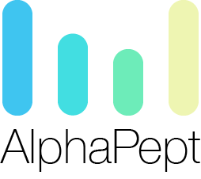

# AlphaPept
> A modular, python-based framework for mass spectrometry. Powered by nbdev.




Current ToDo here:

- Update Installation instructions
- Upload to GitHub and set up dependabot, Travis CI
- Write brief introduction on how to use the modules
- Write how to report bugs / contribute


This file will become your README and also the index of your documentation.

## Install

`pip install your_project_name`

## How to use

### GUI

### Command-Line

### As a Python Package

#### Building Workflows

#### Calling individual functions

```
1+1
```


    2


## Notes for Programmers

### Literal Programming
A key feature is the use of [nbdev](https://github.com/fastai/nbdev). We like to keep the entrance barrier low to attract new coders to contribute to the AlphaPept package. For this, we see nbedv as an ideal tool to document and modify code.

### Testing

In order to make AlphaPept a sustainable package, it is imperative that all functions have tests. This is not only to ensure the proper execution of the function but also for the long run when wanting to keep up-to-date with package updates. For tracking package updates, we rely on [dependabot](https://dependabot.com). For continous integration we use [Travis-CI](https://travis-ci.org).

### Numba - first

We heavily rely on the [Numba](http://numba.pydata.org) package for efficient computation. As writing classes in numba with `@jitclass` requires type specification, in most cases, we prefer functional programming over
Object-oriented programming for simplicity. Here, adding the decorator `@njit` is mostly enough.

### Parallelization strategies

Python has some powerful parallelization tools such as the `multiprocessing` library. `Numba` allows loops to be executed in parallel when flagging with `prange`, which is, from a syntactic point of view, a very elegant solution to parallel processing. It comes with the downside that we cannot easily track the progress of parallel functions that use `prange`. We therefore chunk data where possible to be able to have a progress bar. Additionally, currently, it is not possible to set the number of cores that should be used.

From a data analysis point of view, there are several considerations to be taken into account: When processing multiple files in parallel, it would be suitable to launch several processes in parallel, where the multiprocessing library would come in handy. On the other hand, when only wanting to investigate a single file, having the individual functions parallelized would be beneficial.

Hence, the core idea is to write fast single-core functions and also have parallelized versions where applicable. For multi-file processing, we will rely on the `multiprocessing`.

### Callbacks

As AlphaPept is intended to be the backend of a tool with GUI, we ideally want to be able to get a progress bar out of the major functions. For this, we can pass a `callback`-argument to the major functions. If the argument is passed, it will return the current progress in the range from 0 to 1.

### Constants 

One good way to handle constants would be to use globals. However, numba is not able to use typed dictionaries/classes as globals. We therefore pass them as variables (such as the mass_dict), which in some cases leads to functions with a lot of arguments. Note that `numba` is not able to handle `kwargs` and `args` at this point.
