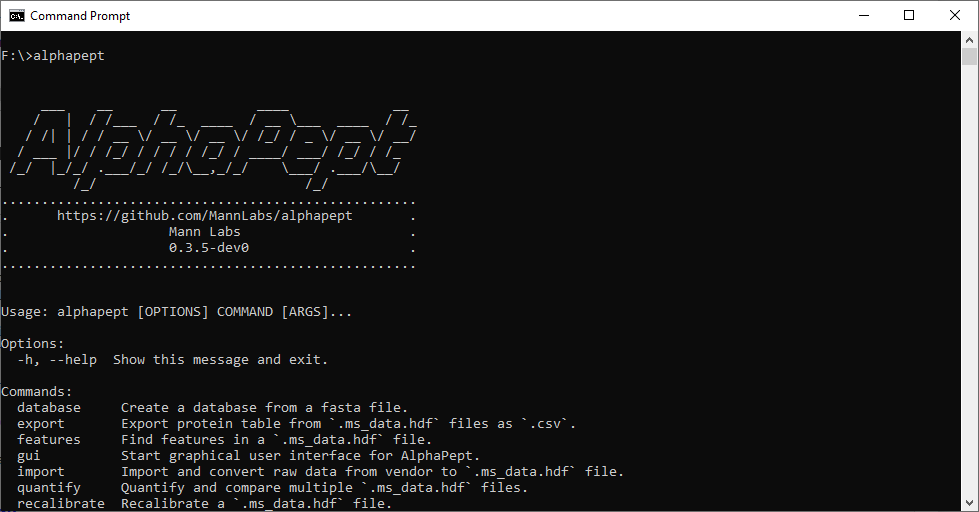

# Title


# AlphaPept


 > A modular, python-based framework to analyze mass spectrometry data. Powered by nbdev. Supercharged with numba.


## Documentation

The documentation is automatically built based on the jupyter notebooks (nbs/index.ipynb) and can be found [here](https://mannlabs.github.io/alphapept/):

This is now the addition to the readme.

## Windows Quickstart


1. Download the latest installer [here](https://github.com/MannLabs/alphapept/releases/latest), install and click the shortcut on the desktop. A browser window with the AlphaPept interface should open. In case Windows Firewall asks for network access for AlphaPept, please allow.
2. In the `New Experiment` select a folder with raw files and FASTA files.
3. Specify additional settings such as modifications with `Settings`.
4. Click `Start` and run the analysis.

See also below for more detailed instructions.

## Current functionality

| Feature         	| Implemented    	|
|-----------------	|----------------	|
| Type            	| DDA            	|
| Filetypes       	| Bruker, Thermo 	|
| Quantification  	| LFQ            	|
| Isobaric labels 	| None           	|
| Platform        	| Windows        	|


## Installation Instructions


### Python

We highly recommend the [Anaconda](https://www.anaconda.com) or [Miniconda](https://docs.conda.io/en/latest/miniconda.html) Python distribution, which comes with a powerful package manager. See below for additional instructions for Linux and Mac as they require additional installation of Mono to use the RawFileReader.

It is strongly recommended to install AlphaPept in its own environment.
1. Open the console and create a new conda environment: `conda create --name alphapept python=3.8`
2. Activate the environment: `conda activate alphapept`
3. Redirect to the folder of choice and clone the repository: `git clone https://github.com/MannLabs/alphapept.git`
4. Navigate to the alphapept folder with `cd alphapept` and install the package with `pip install .` (default users) or with `pip install -e .` to enable developers mode.
5. To ensure compatibility, install strict requirements with `pip install -r requirements.txt`.

If AlphaPept is installed correctly, you should be able to import Alphapept as a package within the environment; see below.

#### GPU Support
To enable usage of a GPU, additional packages need to be installed. The following instructions are targeted at a more experienced audience.

1. Make sure to have a working [CUDA toolkit](https://developer.nvidia.com/cuda-toolkit) installation that is compatible with cupy. To check type `nvcc --version` in your terminal.
2. Install [cupy](https://cupy.dev). Make sure to install the cupy version matching your CUDA toolkit (e.g. `pip install cupy-cuda110` for CUDA toolkit 11.0.


#### Notes
* If you would like to use alphapept in your jupyter notebook environment, additionally install nb_conda: `conda install nb_conda`, which also installs the jupyter notebook extensions. They can be called from a running jupyter instance like so: `http://localhost:8888/nbextensions`.
* For navigating the notebooks, the exension `collapsible headings` and `toc2` are very beneficial.
* For developing with the notebooks, see the `nbev` section below.


#### Linux

1. Install the build-essentials: `sudo apt-get install build-essential`.
2. Install Mono from mono-project website [Mono Linux](https://www.mono-project.com/download/stable/#download-lin). NOTE, the installed mono version should be at least 6.10, which requires you to add the ppa to your trusted sources!
3. Navigate to the alphapept folder and install the package with `pip install .` (default users) or with `pip install -e .` to enable developers mode.
4. Install libgomp.1 with `sudo apt-get install libgomp1`.
5. Copy-paste the Bruker library for feature finding to your /usr/lib folder with `sudo cp alphapept/ext/bruker/FF/linux64/alphapeptlibtbb.so.2 /usr/lib/libtbb.so.2`.


#### Mac

1. Install [brew](https://brew.sh) and pkg-config: `brew install pkg-config`
2. Intall Mono from mono-project website [Mono Mac](https://www.mono-project.com/download/stable/)
3. Register the Mono-Path to your system:
For macOS Catalina, open the configuration of zsh via the terminal:
* Type in `cd` to navigate to the home directory.
* Type `nano ~/.zshrc` to open the configuration of the terminal
* Add the path to your mono installation: `export PKG_CONFIG_PATH=/usr/local/lib/pkgconfig:/usr/lib/pkgconfig:/Library/Frameworks/Mono.framework/Versions/6.12.0/lib/pkgconfig:$PKG_CONFIG_PATH`. Make sure that the Path matches to your version (Here 6.12.0)
* Save everything and execute `. ~/.zshrc`
4. Navigate to the alphapept folder and install the package with `pip install .` (default users) or with `pip install -e .` to enable developers mode.


### Standalone Windows Installer
To use AlphaPept as a stand-alone program for end-users, it can be installed on Windows machines via a one-click installer. Download the latest version [here](http://alphapept.org).


### Additional Notes
> To access Thermo files, we have integrated [RawFileReader](https://planetorbitrap.com/rawfilereader) into AlphaPept. We rely on [Mono](https://www.mono-project.com/) for Linux/Mac systems.

 > To access Bruker files, we rely on the `timsdata`-library. Currently, only Windows is supported. For feature finding, we use the Bruker Feature Finder, which can be found in the `ext` folder of this repository.

## Version Performance
An overview on the performance of different versions can be found [here](https://charts.mongodb.com/charts-alphapept-itfxv/public/dashboards/5f671dcf-bcd6-4d90-8494-8c7f724b727b).

## How to use

AlphaPept is meant to be a framework to implement and test new ideas quickly but also to serve as a performant processing pipeline. In principle, there are three use-cases:

* GUI: Use the graphical user interface to select settings and process files manually.
* CMD: Use the command-line interface to process files. Useful when building automatic pipelines.
* Python: Use python modules to build individual workflows. Useful when building customized pipelines and using Python as a scripting language or when implementing new ideas.

### Windows Standalone Installation

For the [windows installation](https://github.com/MannLabs/alphapept/releases/latest), simply click on the shortcut after installation. The windows installation also installs the command-line tool so that you can call alphapept via `alphapept` in the command line.



### Python Package

Once AlphaPept is correctly installed, you can use it like any other python module.

```
from alphapept.fasta import get_frag_dict, parse
from alphapept import constants

peptide = 'PEPT'

get_frag_dict(parse(peptide), constants.mass_dict)
```


    {'b1': 98.06004032687,
     'b2': 227.10263342686997,
     'b3': 324.15539728686997,
     'y1': 120.06551965033,
     'y2': 217.11828351033,
     'y3': 346.16087661033}


### Using as a tool

If alphapept is installed an a conda or virtual environment, launch this environment first.

To launch the command line interface use:
* `alphapept`

This allows us to select different modules. To start the GUI use:
* `alphapept gui`

Likewise, to start the watcher use:
* `alphapept watcher`
> AlphaPept has a watcher module that continuously monitors a target folder and automatically performs file conversion and feature finding on new files.

To run a workflow, use:* `alphapept workflow your_own_workflow.yaml`An example workflow is easily generated by running the GUI once and saving the settings which an be modified on a per-project basis.

## Analyzing an experiment
This describes the minimal steps to analyze an experiment.

### GUI

1. Open the GUI. Drag and drop experimental files and at least one fasta in the `Experiment` tab.
2. Default settings are loaded and can be changed or saved in the `Settings` tab
3. Navigate to the Run panel and click `Start`

### Investigating the result files
The experimental results will be stored in the corresponding *.hdf-files.

### CMD / Python
1. Create a settings-file. This can be done by changing the `default_settings.yaml` in the repository or using the GUI.
2. Run the analysis with the new settings file. `alphapept run new_settings.yaml`

Within Python (i.e., Jupyter notebook) the following code would be required)
```
from alphapept.settings import load_settings
import alphapept.interface
settings = load_settings('new_settings.yaml')
r = alphapept.interface.run_complete_workflow(settings)
```

## Notebooks

Within the notebooks, we try to cover most aspects of a proteomics workflow:

* Settings: General settings to define a workflow
* Chem: Chemistry related functions, e.g., for calculating isotope distributions
* IO: Everything related to importing and exporting and the file formats used
* FASTA: Generating theoretical databases from FASTA files
* Feature Finding: How to extract MS1 features for quantification
* Search: Comparing theoretical databases to experimental spectra and getting Peptide-Spectrum-Matches (PSMs)
* Score: Scoring PSMs
* Recalibration: Recalibration of data based on identified peptides
* Quantification: Functions for quantification, e.g., LFQ
* Matching: Functions for Match-between-runs
* Constants: A collection of constants
* Interface: Code that generates the command-line-interface (CLI)
* Speed: Helper functions to speed up code with CPU / GPU

## Contributing
If you have a feature request or a bug report, please post it as an issue on the GitHub issue tracker. If you want to contribute, put a PR for it. You can find more guidelines for contributing and how to get started [here](https://github.com/MannLabs/alphapept/blob/master/CONTRIBUTING.md). We will gladly guide you through the codebase and credit you accordingly. Additionally, you can check out the Projects-page on GitHub. You can also contact us via opensource@alphapept.com.
